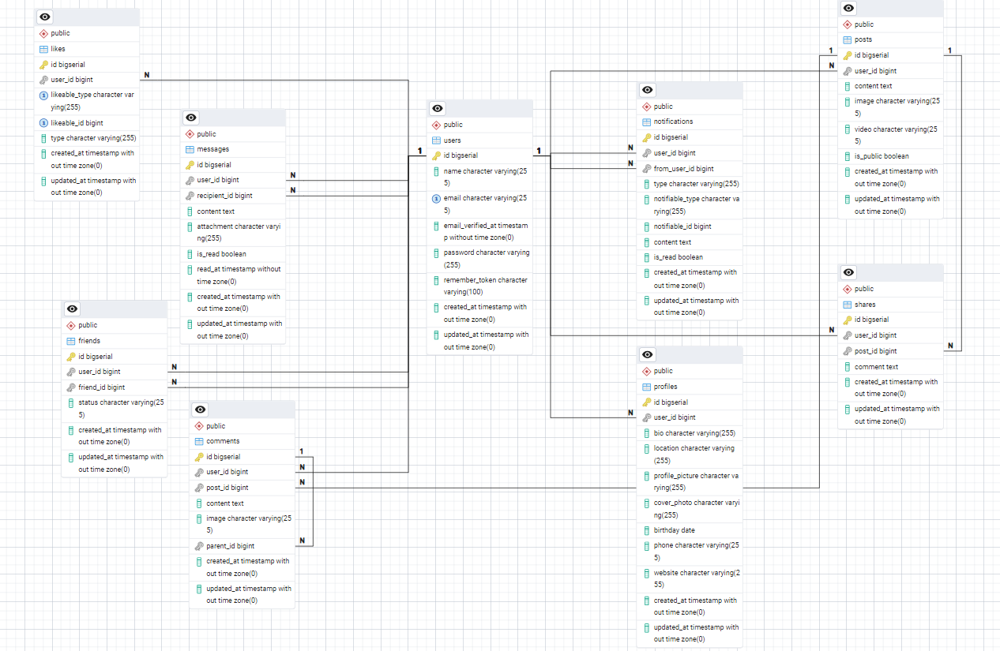

# Laravel Technical Documentation - Facebook Clone

## Table of Contents
1. [Project Overview](#project-overview)
2. [Laravel Framework Architecture](#laravel-framework-architecture)
3. [Database Architecture](#database-architecture)
4. [Models and Relationships](#models-and-relationships)
5. [Controllers and Business Logic](#controllers-and-business-logic)
6. [Routing System](#routing-system)
7. [Authentication and Authorization](#authentication-and-authorization)
8. [Views and Frontend Integration](#views-and-frontend-integration)
9. [Services and Custom Logic](#services-and-custom-logic)
10. [Notifications System](#notifications-system)
11. [Configuration and Environment](#configuration-and-environment)
12. [Performance Optimization](#performance-optimization)
13. [Security Implementation](#security-implementation)
14. [Testing Strategy](#testing-strategy)

## Project Overview

This project is a comprehensive Facebook clone built using **Laravel 12.x** with PHP 8.2+. It implements a full-featured social media platform with modern web development practices.

### Key Technologies
- **Framework**: Laravel 12.x
- **PHP Version**: 8.2+
- **Frontend**: Blade Templates + Tailwind CSS + Alpine.js
- **Database**: PostgreSQL (with support for other databases)
- **Build Tools**: Vite
- **Authentication**: Laravel Breeze
- **Testing**: PHPUnit

### Core Features Implemented
- User authentication and registration
- Social media posts with media support
- Comments and nested replies
- Like/unlike system for posts and comments
- Friend system with requests
- Real-time notifications
- Private messaging
- User profiles
- News feed algorithm
- Post sharing functionality

## Laravel Framework Architecture

### What is Laravel and Why Use It?

**Laravel** is a modern PHP web application framework that follows the Model-View-Controller (MVC) architectural pattern. It was created by Taylor Otwell and has become one of the most popular PHP frameworks due to its:

#### Key Advantages:
1. **Elegant Syntax** - Clean, expressive code that's easy to read and maintain
2. **Rich Ecosystem** - Extensive package ecosystem and built-in tools
3. **Developer Experience** - Excellent documentation, debugging tools, and development workflow
4. **Security Features** - Built-in protection against common vulnerabilities
5. **Performance** - Optimized for speed with built-in caching and optimization features
6. **Scalability** - Can handle everything from small projects to enterprise applications

#### Why Laravel Over Other PHP Frameworks?
- **Symfony**: Laravel is built on Symfony components but offers a more developer-friendly API
- **CodeIgniter**: Laravel provides more modern features and better architecture
- **Zend/Laminas**: Laravel has a gentler learning curve and better documentation
- **Raw PHP**: Laravel eliminates boilerplate code and provides structure and security out of the box

### MVC Pattern Implementation

Laravel implements the MVC (Model-View-Controller) pattern, which separates application logic into three interconnected components:

#### Models (`app/Models/`) - Data Layer
Models represent data and business logic. In Laravel, models are Eloquent classes that interact with the database:

- **User.php** - Core user entity with authentication capabilities
- **Post.php** - Social media posts with media support and engagement tracking
- **Comment.php** - Comments on posts with nested hierarchical support
- **Like.php** - Polymorphic like system that can be applied to multiple content types
- **Friend.php** - Friend relationship management with request/acceptance workflow
- **Share.php** - Post sharing functionality with custom messages
- **Message.php** - Direct messaging between users
- **Notification.php** - System notifications for user interactions
- **Profile.php** - Extended user information and customization

**Why Use Eloquent Models?**
- **Active Record Pattern**: Each model corresponds to a database table
- **Relationship Management**: Easy definition of complex relationships
- **Query Builder**: Fluent, readable database queries
- **Mass Assignment Protection**: Built-in security features
- **Automatic Timestamps**: Created/updated timestamps handled automatically

#### Views (`resources/views/`) - Presentation Layer
Views handle the presentation logic and user interface:

- **Blade Templates** - Laravel's templating engine (explained in detail below)
- **Component System** - Reusable UI components for consistent design
- **Layout System** - Master layouts for consistent page structure
- **Partial Views** - Small, reusable view fragments

#### Controllers (`app/Http/Controllers/`) - Application Logic Layer
Controllers handle HTTP requests and coordinate between models and views:

- **Resource Controllers** - RESTful API endpoints following REST conventions
- **Custom Controllers** - Specialized business logic for complex features
- **Form Request Handling** - Input validation and processing
- **Response Management** - JSON, redirect, and view responses

### Service Container and Dependency Injection

Laravel's service container manages class dependencies and performs dependency injection throughout the application. Key services include:

```php
// Example from DashboardController
use Illuminate\Support\Facades\Auth;
use Illuminate\Support\Facades\DB;
```

### Eloquent ORM Integration

#### What is Eloquent ORM?

**Eloquent** is Laravel's built-in Object-Relational Mapping (ORM) system. It provides a beautiful, simple ActiveRecord implementation for working with your database.

#### Why Use Eloquent Over Other Database Solutions?

**Compared to Raw SQL:**
- **Security**: Built-in protection against SQL injection
- **Productivity**: Faster development with less boilerplate code
- **Relationships**: Easy definition and management of table relationships
- **Migration Integration**: Seamless integration with Laravel's migration system

**Compared to Query Builder:**
- **Object-Oriented**: Work with models instead of arrays
- **Relationships**: Automatic relationship loading and management
- **Events**: Model events for hooks and observers
- **Validation**: Built-in validation and mass assignment protection

**Compared to Other ORMs (Doctrine, etc.):**
- **Laravel Integration**: Perfect integration with Laravel ecosystem
- **Simplicity**: Easier learning curve and implementation
- **Performance**: Optimized for Laravel applications
- **Community**: Large Laravel community and resources

#### Eloquent Features Used in This Project:

**1. Model Relationships:**
```php
// One-to-Many relationship (User has many Posts)
class User extends Model {
    public function posts(): HasMany {
        return $this->hasMany(Post::class);
    }
}

// Inverse relationship (Post belongs to User)
class Post extends Model {
    public function user(): BelongsTo {
        return $this->belongsTo(User::class);
    }
}

// Usage
$user = User::find(1);
$userPosts = $user->posts; // Collection of posts
$post = Post::find(1);
$postAuthor = $post->user; // User object
```

**2. Complex Queries with Relationships:**
```php
// Complex relationship queries in DashboardController
$posts = Post::whereIn('user_id', $friendIds)
    ->where(function($query) {
        $query->where('is_public', true)
            ->orWhere('user_id', Auth::id());
    })
    ->with(['user', 'comments.user', 'likes', 'shares.user'])
    ->orderBy('created_at', 'desc')
    ->paginate(10);
```

**3. Polymorphic Relationships:**
```php
// Like model can belong to Posts or Comments
class Like extends Model {
    public function likeable(): MorphTo {
        return $this->morphTo();
    }
}

// Post model has polymorphic likes
class Post extends Model {
    public function likes(): MorphMany {
        return $this->morphMany(Like::class, 'likeable');
    }
}

// Comment model has polymorphic likes
class Comment extends Model {
    public function likes(): MorphMany {
        return $this->morphMany(Like::class, 'likeable');
    }
}

// Usage
$post = Post::find(1);
$post->likes; // All likes for this post

$comment = Comment::find(1);
$comment->likes; // All likes for this comment
```

**4. Advanced Relationship Queries:**
```php
// Friend system with complex bidirectional relationships
public function friends() {
    return $this->sentFriendRequests()
        ->where('status', 'accepted')
        ->with('friend')
        ->get()
        ->pluck('friend')
        ->merge(
            $this->receivedFriendRequests()
                ->where('status', 'accepted')
                ->with('user')
                ->get()
                ->pluck('user')
        );
}
```

**5. Model Attributes and Accessors:**
```php
class Post extends Model {
    // Custom accessor for like count
    public function getLikesCountAttribute() {
        return $this->likes()->count();
    }
    
    // Custom accessor for comments count
    public function getCommentsCountAttribute() {
        return $this->comments()->count();
    }
    
    // Custom method to check if user liked the post
    public function isLikedBy(User $user) {
        return $this->likes()->where('user_id', $user->id)->exists();
    }
}

// Usage in Blade templates
{{ $post->likes_count }} // Calls getLikesCountAttribute()
@if($post->isLikedBy(auth()->user()))
    <span class="text-blue-500">Liked</span>
@endif
```

**6. Mass Assignment Protection:**
```php
class Post extends Model {
    // Only these fields can be mass assigned
    protected $fillable = [
        'user_id', 'content', 'image', 'video', 'is_public'
    ];
    
    // These fields are hidden from JSON serialization
    protected $hidden = [
        'deleted_at'
    ];
    
    // Automatic casting of attributes
    protected function casts(): array {
        return [
            'is_public' => 'boolean',
            'created_at' => 'datetime',
        ];
    }
}
```

**7. Query Scopes:**
```php
class Post extends Model {
    // Global scope for published posts
    public function scopePublished($query) {
        return $query->where('is_public', true);
    }
    
    // Scope for posts by friends
    public function scopeByFriends($query, $friendIds) {
        return $query->whereIn('user_id', $friendIds);
    }
}

// Usage
$publicPosts = Post::published()->get();
$friendPosts = Post::byFriends($friendIds)->published()->get();
```

**8. Model Events:**
```php
class Post extends Model {
    protected static function booted() {
        // Automatically create notification when post is liked
        static::creating(function ($post) {
            // Set user_id if not provided
            if (!$post->user_id) {
                $post->user_id = auth()->id();
            }
        });
        
        static::created(function ($post) {
            // Create notification for followers
            Notification::create([
                'user_id' => $post->user_id,
                'type' => 'post_created',
                'data' => ['post_id' => $post->id]
            ]);
        });
    }
}
```

## Database Architecture

### Database Schema Design

The application uses a relational database with a comprehensive schema designed for social media functionality:



#### Core Tables

1. **users** - User authentication and basic information
   - Primary key: `id`
   - Contains: `name`, `email`, `password`, timestamps
   - Central entity that connects to all other tables

2. **profiles** - Extended user profile data
   - Foreign key: `user_id` → `users.id`
   - Contains: `bio`, `location`, `birthday`, `phone`, `website`, `profile_picture`, `cover_photo`
   - One-to-one relationship with users

3. **posts** - Social media posts
   - Foreign key: `user_id` → `users.id`
   - Contains: `content`, `image`, `video`, `is_public`
   - Core content entity for the social platform

4. **comments** - Comments with hierarchical structure
   - Foreign keys: `user_id` → `users.id`, `post_id` → `posts.id`
   - Self-referencing: `parent_id` → `comments.id` for nested replies
   - Contains: `content` and timestamps

5. **likes** - Polymorphic likes for posts/comments
   - Foreign key: `user_id` → `users.id`
   - Polymorphic fields: `likeable_id`, `likeable_type`
   - Can be attached to both posts and comments

6. **friends** - Friend relationships and requests
   - Foreign keys: `user_id` → `users.id`, `friend_id` → `users.id`
   - Self-referencing many-to-many relationship
   - Contains: `status` (pending, accepted, rejected)

7. **shares** - Post sharing functionality
   - Foreign keys: `user_id` → `users.id`, `post_id` → `posts.id`
   - Contains: custom `message` for the share

8. **messages** - Direct messaging
   - Foreign keys: `user_id` → `users.id`, `recipient_id` → `users.id`
   - Contains: `content`, `is_read`, timestamps

9. **notifications** - System notifications
   - Foreign keys: `user_id` → `users.id`, `from_user_id` → `users.id`
   - Polymorphic fields: `notifiable_id`, `notifiable_type`
   - Contains: `type`, `content`, `is_read`

10. **sessions** - User session management
    - Laravel's built-in session storage

#### Laravel System Tables
- **cache** - Application caching
- **jobs** - Queue job management
- **migrations** - Database version control

### Migration System

The project uses Laravel migrations for database version control:

```php
// Example migration structure
return new class extends Migration {
    public function up(): void {
        Schema::create('posts', function (Blueprint $table) {
            $table->id();
            $table->foreignId('user_id')->constrained()->onDelete('cascade');
            $table->text('content');
            $table->string('image')->nullable();
            $table->string('video')->nullable();
            $table->boolean('is_public')->default(true);
            $table->timestamps();
        });
    }
};
```

### Database Relationships

The database implements complex relationships:

- **One-to-One**: User ↔ Profile
- **One-to-Many**: User → Posts, Posts → Comments
- **Many-to-Many**: Users ↔ Friends (through pivot table)
- **Polymorphic**: Likes can belong to Posts or Comments

## Models and Relationships

### User Model (`app/Models/User.php`)

The User model is the central entity extending Laravel's Authenticatable:

```php
class User extends Authenticatable
{
    use HasFactory, Notifiable;
    
    // Mass assignable attributes
    protected $fillable = ['name', 'email', 'password'];
    
    // Hidden attributes for serialization
    protected $hidden = ['password', 'remember_token'];
    
    // Attribute casting
    protected function casts(): array {
        return [
            'email_verified_at' => 'datetime',
            'password' => 'hashed',
        ];
    }
}
```

#### Key Relationships in User Model:
- `profile()` - One-to-one with Profile
- `posts()` - One-to-many with Posts
- `comments()` - One-to-many with Comments
- `likes()` - One-to-many with Likes
- `shares()` - One-to-many with Shares
- `sentFriendRequests()` - One-to-many with Friends
- `receivedFriendRequests()` - One-to-many with Friends
- `notifications()` - One-to-many with Notifications
- `sentMessages()` - One-to-many with Messages
- `receivedMessages()` - One-to-many with Messages

### Post Model (`app/Models/Post.php`)

The Post model handles social media posts:

```php
class Post extends Model
{
    use HasFactory;
    
    protected $fillable = [
        'user_id', 'content', 'image', 'video', 'is_public'
    ];
    
    protected function casts(): array {
        return ['is_public' => 'boolean'];
    }
}
```

#### Key Features:
- **Polymorphic Likes**: Uses `morphMany` relationship
- **Nested Comments**: Hierarchical comment structure
- **Visibility Control**: Public/private post settings
- **Media Support**: Image and video attachments

#### Custom Methods:
- `isLikedBy(User $user)` - Check if user liked the post
- `isSharedBy(User $user)` - Check if user shared the post
- `getLikesCountAttribute()` - Dynamic attribute for like count
- `getCommentsCountAttribute()` - Dynamic attribute for comment count
- `getSharesCountAttribute()` - Dynamic attribute for share count

### Advanced Relationship Patterns

#### Friend System Implementation
The friend system uses a self-referencing many-to-many relationship:

```php
// In User model
public function friends() {
    return $this->sentFriendRequests()
        ->where('status', 'accepted')
        ->with('friend')
        ->get()
        ->pluck('friend')
        ->merge(
            $this->receivedFriendRequests()
                ->where('status', 'accepted')
                ->with('user')
                ->get()
                ->pluck('user')
        );
}
```

#### Polymorphic Relationships
The Like model uses polymorphic relationships to handle likes on different models:

```php
// In Post model
public function likes(): MorphMany {
    return $this->morphMany(Like::class, 'likeable');
}

// In Comment model  
public function likes(): MorphMany {
    return $this->morphMany(Like::class, 'likeable');
}
```

## Controllers and Business Logic

### DashboardController (`app/Http/Controllers/DashboardController.php`)

The DashboardController manages the main news feed functionality:

#### Key Features:
1. **Friend Discovery**: Retrieves user's friends from bidirectional relationships
2. **News Feed Algorithm**: Combines posts and shares, sorted by date
3. **Privacy Controls**: Filters content based on visibility settings
4. **Pagination**: Manual pagination for combined results
5. **Friend Suggestions**: Random friend recommendations
6. **Activity Feed**: Recent notifications and activities

#### Complex Query Example:
```php
$posts = Post::whereIn('user_id', $friendIds)
    ->where(function($query) {
        $query->where('is_public', true)
            ->orWhere('user_id', Auth::id());
    })
    ->with(['user', 'comments.user', 'likes', 'shares.user']);
```

### Resource Controllers

The project uses Laravel's resource controllers for CRUD operations:

#### PostController
- `index()` - List user's posts
- `create()` - Show post creation form
- `store()` - Create new post
- `show()` - Display single post
- `edit()` - Show edit form
- `update()` - Update existing post
- `destroy()` - Delete post

### Specialized Controllers

#### FriendController (`app/Http/Controllers/FriendController.php`)
Handles complex friend relationship logic:
- Friend request management
- Friend suggestions
- Friend search functionality
- Request acceptance/rejection

#### LikeController (`app/Http/Controllers/LikeController.php`)
Manages polymorphic like system:
- Like/unlike posts
- Like/unlike comments
- Real-time like counts

#### NotificationController (`app/Http/Controllers/NotificationController.php`)
Handles notification system:
- Mark notifications as read
- Bulk notification actions
- AJAX endpoints for real-time updates

## Routing System

### Route Organization (`routes/web.php`)

The application uses Laravel's routing system with organized route groups:

#### Public Routes
```php
Route::get('/', function () {
    return view('welcome');
});
```

#### Protected Routes with Middleware
```php
Route::middleware(['auth', 'verified'])->group(function () {
    // Dashboard
    Route::get('/dashboard', [DashboardController::class, 'index'])->name('dashboard');
    
    // Resource routes
    Route::resource('posts', PostController::class);
    Route::resource('comments', CommentController::class)->except(['index', 'show']);
    
    // Custom routes with parameters
    Route::post('/posts/{post}/like', [LikeController::class, 'likePost'])->name('posts.like');
    Route::post('/comments/{comment}/like', [LikeController::class, 'likeComment'])->name('comments.like');
});
```

#### Route Features:
- **Named Routes**: All routes have names for easy reference
- **Route Model Binding**: Automatic model injection
- **Route Groups**: Organized by functionality
- **Middleware Protection**: Authentication and verification
- **RESTful Conventions**: Following REST principles

### Route Patterns

#### Friend System Routes
```php
Route::post('/friends/{user}', [FriendController::class, 'sendRequest'])->name('friends.request');
Route::patch('/friends/{friend}/accept', [FriendController::class, 'acceptRequest'])->name('friends.accept');
Route::patch('/friends/{friend}/reject', [FriendController::class, 'rejectRequest'])->name('friends.reject');
```

#### AJAX API Routes
```php
Route::post('/notifications/{notification}/read', [NotificationController::class, 'markAsRead'])->name('notifications.ajax.read');
Route::post('/notifications/mark-all-read', [NotificationController::class, 'markAllAsRead'])->name('notifications.ajax.read.all');
```

## Authentication and Authorization

### Laravel Breeze Integration

#### What is Laravel Breeze?

**Laravel Breeze** is Laravel's official, lightweight authentication starter kit. It provides a minimal and simple starting point for building Laravel applications with authentication features.

#### What Breeze Includes:
1. **Pre-built Authentication Views** - Login, registration, password reset, email verification
2. **Authentication Controllers** - Ready-to-use controllers for auth workflows
3. **Middleware Configuration** - Pre-configured authentication middleware
4. **Frontend Scaffolding** - Choice of frontend stacks (Blade, React, Vue, Inertia)
5. **Tailwind CSS Integration** - Modern, responsive design out of the box

#### Why Use Laravel Breeze?

**Compared to Laravel Jetstream:**
- **Simplicity**: Breeze is simpler and easier to customize
- **Lightweight**: Fewer dependencies and less bloat
- **Learning Curve**: Easier for beginners to understand and modify
- **Flexibility**: Easier to customize without breaking core functionality

**Compared to Building from Scratch:**
- **Time Saving**: Weeks of development reduced to minutes
- **Security**: Battle-tested authentication logic
- **Best Practices**: Follows Laravel conventions and security practices
- **Maintenance**: Less code to maintain and debug

**Compared to Other Auth Packages:**
- **Official Support**: Maintained by the Laravel team
- **Integration**: Perfect integration with Laravel ecosystem
- **Documentation**: Comprehensive official documentation
- **Updates**: Regular updates aligned with Laravel releases

#### Features Implemented in This Project:

1. **User Registration**
   ```php
   // Handles user registration with validation
   Route::post('/register', [RegisteredUserController::class, 'store']);
   ```

2. **User Login/Logout**
   ```php
   // Authentication routes
   Route::post('/login', [AuthenticatedSessionController::class, 'store']);
   Route::post('/logout', [AuthenticatedSessionController::class, 'destroy']);
   ```

3. **Email Verification**
   ```php
   // Email verification workflow
   Route::get('/verify-email', [EmailVerificationPromptController::class, '__invoke'])
        ->name('verification.notice');
   ```

4. **Password Reset**
   ```php
   // Password reset functionality
   Route::post('/forgot-password', [PasswordResetLinkController::class, 'store']);
   Route::post('/reset-password', [NewPasswordController::class, 'store']);
   ```

5. **Remember Me Functionality** - Persistent login sessions
6. **Session Management** - Secure session handling
7. **Profile Management** - User profile updates

#### Breeze Architecture in This Project:

**Authentication Controllers** (`app/Http/Controllers/Auth/`):
- `AuthenticatedSessionController` - Login/logout logic
- `RegisteredUserController` - User registration
- `PasswordResetLinkController` - Password reset emails
- `NewPasswordController` - Password reset processing
- `EmailVerificationNotificationController` - Email verification
- `ConfirmablePasswordController` - Password confirmation

**Authentication Views** (`resources/views/auth/`):
- `login.blade.php` - Login form
- `register.blade.php` - Registration form
- `forgot-password.blade.php` - Password reset request
- `reset-password.blade.php` - Password reset form
- `verify-email.blade.php` - Email verification notice

**Authentication Routes** (`routes/auth.php`):
```php
Route::middleware('guest')->group(function () {
    Route::get('register', [RegisteredUserController::class, 'create'])->name('register');
    Route::post('register', [RegisteredUserController::class, 'store']);
    Route::get('login', [AuthenticatedSessionController::class, 'create'])->name('login');
    Route::post('login', [AuthenticatedSessionController::class, 'store']);
    // ... more routes
});
```

#### Middleware Stack:

**Authentication Middleware:**
- `auth` - Requires user authentication
- `verified` - Requires email verification
- `guest` - Allows only non-authenticated users
- `throttle` - Rate limiting for security

**Implementation Example:**
```php
Route::middleware(['auth', 'verified'])->group(function () {
    // All social media features require authentication
    Route::get('/dashboard', [DashboardController::class, 'index'])->name('dashboard');
    Route::resource('posts', PostController::class);
    // ... protected routes
});
```

#### Security Features Provided by Breeze:

1. **CSRF Protection** - Cross-site request forgery protection
2. **Password Hashing** - Bcrypt password hashing
3. **Session Security** - Secure session management
4. **Rate Limiting** - Brute force attack prevention
5. **Email Verification** - Prevents fake account creation
6. **Input Validation** - Server-side validation of all inputs

### Route Protection

All social features are protected by authentication middleware:

```php
Route::middleware(['auth', 'verified'])->group(function () {
    // Protected routes here
});
```

### Authorization Policies

The application implements authorization through:
- Model policies for resource access
- Gate definitions for complex permissions
- Middleware for route-level protection

## Views and Frontend Integration

### Blade Template System

#### What is Laravel Blade?

**Laravel Blade** is Laravel's powerful templating engine that allows you to write clean, readable templates with PHP code. Unlike other PHP templating engines, Blade doesn't restrict you from using plain PHP code in your views.

#### Why Use Blade Over Other Templating Options?

**Compared to Plain PHP:**
- **Cleaner Syntax**: `{{ $user->name }}` vs `<?php echo htmlspecialchars($user->name); ?>`
- **Automatic Escaping**: Built-in XSS protection
- **Template Inheritance**: Master layouts and sections
- **Component System**: Reusable UI components
- **Blade Directives**: Simplified control structures

**Compared to Twig:**
- **Laravel Integration**: Seamless integration with Laravel features
- **Performance**: Compiles to plain PHP (no runtime overhead)
- **PHP Flexibility**: Can use PHP code when needed
- **Laravel Features**: Access to Laravel helpers and facades

**Compared to Vue/React in Blade:**
- **Server-Side Rendering**: Better SEO and initial page load
- **Simplicity**: No complex build processes for simple interactions
- **Laravel Integration**: Direct access to Laravel data and features
- **Progressive Enhancement**: Can add JavaScript where needed

#### Blade Syntax and Features:

**1. Data Display:**
```php
<!-- Escaped output (safe from XSS) -->
<h1>{{ $user->name }}</h1>

<!-- Raw output (be careful!) -->
<div>{!! $post->html_content !!}</div>

<!-- Default values -->
<p>{{ $comment ?? 'No comment provided' }}</p>
```

**2. Control Structures:**
```php
<!-- Conditional statements -->
@if($user->hasUnreadNotifications())
    <span class="notification-badge">{{ $user->unreadCount() }}</span>
@endif

<!-- Loops -->
@foreach($posts as $post)
    <div class="post">
        <h3>{{ $post->title }}</h3>
        <p>{{ $post->content }}</p>
    </div>
@endforeach

<!-- Switch statements -->
@switch($post->type)
    @case('image')
        image_url }}" alt="Post image">
        @break
    @case('video')
        <video src="{{ $post->video_url }}" controls></video>
        @break
    @default
        <p>{{ $post->content }}</p>
@endswitch
```

**3. Template Inheritance:**
```php
<!-- Layout file: resources/views/layouts/app.blade.php -->
<!DOCTYPE html>
<html>
<head>
    <title>@yield('title', 'Facebook Clone')</title>
    @vite(['resources/css/app.css', 'resources/js/app.js'])
</head>
<body>
    <nav>@include('partials.navigation')</nav>
    <main>@yield('content')</main>
    <footer>@include('partials.footer')</footer>
</body>
</html>

<!-- Child template: resources/views/dashboard.blade.php -->
@extends('layouts.app')

@section('title', 'News Feed')

@section('content')
    <div class="news-feed">
        @foreach($posts as $post)
            @include('partials.post-card', ['post' => $post])
        @endforeach
    </div>
@endsection
```

**4. Components System:**
```php
<!-- Component definition: resources/views/components/post-card.blade.php -->
<div class="post-card bg-white rounded-lg shadow-md p-6 mb-4">
    <div class="post-header flex items-center mb-4">
        user->avatar }}" class="w-10 h-10 rounded-full mr-3">
        <div>
            <h4 class="font-semibold">{{ $post->user->name }}</h4>
            <p class="text-gray-500 text-sm">{{ $post->created_at->diffForHumans() }}</p>
        </div>
    </div>
    
    <div class="post-content mb-4">
        <p>{{ $post->content }}</p>
        @if($post->image)
            image) }}" class="mt-3 rounded-lg max-w-full">
        @endif
    </div>
    
    <div class="post-actions flex justify-between">
        <button class="like-btn {{ $post->isLikedBy(auth()->user()) ? 'text-blue-500' : 'text-gray-500' }}">
            <i class="fas fa-thumbs-up"></i> {{ $post->likes_count }} Likes
        </button>
        <button class="comment-btn text-gray-500">
            <i class="fas fa-comment"></i> {{ $post->comments_count }} Comments
        </button>
        <button class="share-btn text-gray-500">
            <i class="fas fa-share"></i> Share
        </button>
    </div>
</div>

<!-- Usage in templates -->
<x-post-card :post="$post" />
```

#### Template Hierarchy in This Project:

**Layouts** (`resources/views/layouts/`):
```php
<!-- app.blade.php - Main application layout -->
<!DOCTYPE html>
<html lang="{{ str_replace('_', '-', app()->getLocale()) }}">
<head>
    <meta charset="utf-8">
    <meta name="viewport" content="width=device-width, initial-scale=1">
    <meta name="csrf-token" content="{{ csrf_token() }}">
    <title>{{ config('app.name', 'Laravel') }}</title>
    @vite(['resources/css/app.css', 'resources/js/app.js'])
</head>
<body class="font-sans antialiased">
    @include('layouts.navigation')
    <main>@yield('content')</main>
</body>
</html>
```

**Components** (`resources/views/components/`):
- `post-card.blade.php` - Individual post display
- `notification-badge.blade.php` - Notification counter
- `friend-request.blade.php` - Friend request item
- `comment-thread.blade.php` - Comment display with replies
- `navigation.blade.php` - Main navigation bar

**Pages** (`resources/views/`) - Individual page templates:

1. **dashboard.blade.php** - Main news feed
```php
@extends('layouts.app')

@section('content')
<div class="max-w-6xl mx-auto py-6 px-4">
    <div class="grid grid-cols-1 lg:grid-cols-3 gap-6">
        <!-- Left sidebar - Friend suggestions -->
        <div class="lg:col-span-1">
            @include('partials.friend-suggestions', ['suggestions' => $friendSuggestions])
        </div>
        
        <!-- Main content - Posts feed -->
        <div class="lg:col-span-2">
            @include('partials.create-post-form')
            
            @foreach($posts as $post)
                @if($post instanceof App\Models\Post)
                    <x-post-card :post="$post" />
                @else
                    @include('partials.shared-post', ['share' => $post])
                @endif
            @endforeach
            
            {{ $posts->links() }}
        </div>
    </div>
</div>
@endsection
```

2. **profile/** - User profile pages
3. **posts/** - Post-related views
4. **friends/** - Friend management interfaces
5. **messages/** - Messaging interface
6. **notifications/** - Notification center

#### Blade Directives Used in This Project:

**Custom Directives:**
```php
<!-- Check if user is authenticated -->
@auth
    <div class="user-menu">Welcome, {{ auth()->user()->name }}!</div>
@endauth

@guest
    <div class="login-prompt">Please log in to continue.</div>
@endguest

<!-- Include subviews -->
@include('partials.post-actions', ['post' => $post])

<!-- Loop through collections -->
@forelse($notifications as $notification)
    <div class="notification-item">{{ $notification->message }}</div>
@empty
    <p class="text-gray-500">No notifications yet.</p>
@endforelse

<!-- Stack for additional scripts -->
@push('scripts')
    <script src="/js/post-interactions.js"></script>
@endpush
```

### Frontend Technology Stack

#### Tailwind CSS Integration

**What is Tailwind CSS?**

Tailwind CSS is a utility-first CSS framework that provides low-level utility classes to build custom designs directly in your markup.

**Why Use Tailwind CSS?**

**Compared to Bootstrap:**
- **Customization**: Highly customizable without overriding existing styles
- **File Size**: Smaller production builds (only includes used classes)
- **Design Flexibility**: More design freedom, less opinionated
- **Utility-First**: Build custom designs without writing CSS

**Compared to Custom CSS:**
- **Consistency**: Predefined spacing, colors, and sizing scales
- **Speed**: No need to name classes or write CSS files
- **Maintenance**: Changes in markup, not separate CSS files
- **Responsiveness**: Built-in responsive design utilities

**Compared to CSS-in-JS:**
- **Server-Side Rendering**: Works perfectly with Blade templates
- **Learning Curve**: Easier for developers familiar with CSS
- **Performance**: No runtime JavaScript overhead
- **Build Integration**: Seamless Laravel integration

**Tailwind Implementation in This Project:**

**Configuration** (`tailwind.config.js`):
```javascript
export default {
    content: [
        "./resources/**/*.blade.php",
        "./resources/**/*.js",
        "./resources/**/*.vue",
    ],
    theme: {
        extend: {
            colors: {
                'facebook-blue': '#1877f2',
                'facebook-green': '#42b883',
            },
            fontFamily: {
                sans: ['Figtree', ...defaultTheme.fontFamily.sans],
            },
        },
    },
    plugins: [
        forms,
        typography,
    ],
}
```

**Usage Examples:**
```php
<!-- Post card styling -->
<div class="bg-white rounded-lg shadow-md p-6 mb-4 hover:shadow-lg transition-shadow">
    <!-- Flexbox layout -->
    <div class="flex items-center justify-between mb-4">
        <!-- Avatar -->
        avatar }}">
        
        <!-- Responsive text -->
        <h3 class="text-lg font-semibold text-gray-900 sm:text-xl">{{ $post->title }}</h3>
        
        <!-- Button with hover effects -->
        <button class="bg-blue-500 hover:bg-blue-600 text-white px-4 py-2 rounded-md transition-colors">
            Like
        </button>
    </div>
</div>

<!-- Responsive grid layout -->
<div class="grid grid-cols-1 md:grid-cols-2 lg:grid-cols-3 gap-6">
    @foreach($posts as $post)
        <x-post-card :post="$post" />
    @endforeach
</div>

<!-- Mobile-first responsive design -->
<nav class="hidden sm:flex sm:space-x-8">
    <a class="text-gray-500 hover:text-gray-700 px-3 py-2 text-sm font-medium">
        Home
    </a>
</nav>
```

**Key Tailwind Features Used:**
- **Spacing**: `p-4`, `m-6`, `space-x-4`
- **Colors**: `bg-blue-500`, `text-gray-700`
- **Layout**: `flex`, `grid`, `grid-cols-3`
- **Responsive**: `sm:hidden`, `lg:flex`
- **States**: `hover:bg-blue-600`, `focus:ring-2`
- **Transitions**: `transition-all`, `duration-300`

#### Alpine.js Integration

**What is Alpine.js?**

Alpine.js is a rugged, minimal JavaScript framework for composing behavior directly in your markup. It's designed to be the "jQuery for the modern web."

**Why Use Alpine.js?**

**Compared to Vue.js/React:**
- **Simplicity**: No build step required
- **Learning Curve**: Easier to learn and implement
- **Size**: Much smaller footprint (~10kb vs 100kb+)
- **Server-Side Integration**: Works seamlessly with server-rendered HTML

**Compared to jQuery:**
- **Modern Syntax**: Uses modern JavaScript concepts
- **Reactivity**: Built-in reactive data binding
- **Declarative**: Behavior defined in HTML attributes
- **No DOM Manipulation**: Reactive updates handle DOM changes

**Compared to Vanilla JavaScript:**
- **Reactivity**: Automatic DOM updates when data changes
- **Event Handling**: Simplified event management
- **State Management**: Built-in state management
- **Directives**: Powerful directives for common patterns

**Alpine.js Implementation in This Project:**

**Basic Usage Examples:**
```php
<!-- Like button with real-time updates -->
<div x-data="{ liked: {{ $post->isLikedBy(auth()->user()) ? 'true' : 'false' }}, likes: {{ $post->likes_count }} }">
    <button 
        @click="liked = !liked; likes += liked ? 1 : -1"
        :class="liked ? 'text-blue-500' : 'text-gray-500'"
        class="flex items-center space-x-2 hover:text-blue-600 transition-colors"
    >
        <i class="fas fa-thumbs-up"></i>
        <span x-text="likes + ' Likes'"></span>
    </button>
</div>

<!-- Comment toggle -->
<div x-data="{ showComments: false }">
    <button @click="showComments = !showComments" class="text-gray-500 hover:text-gray-700">
        <i class="fas fa-comment"></i> 
        <span x-text="showComments ? 'Hide Comments' : 'Show Comments'"></span>
    </button>
    
    <div x-show="showComments" x-transition class="mt-4">
        @include('partials.comments', ['comments' => $post->comments])
    </div>
</div>

<!-- Friend request handling -->
<div x-data="{ 
    status: '{{ $friendRequest->status }}',
    loading: false,
    
    async acceptRequest() {
        this.loading = true;
        try {
            await fetch('/friends/{{ $friendRequest->id }}/accept', {
                method: 'PATCH',
                headers: { 'X-CSRF-TOKEN': document.querySelector('meta[name=csrf-token]').content }
            });
            this.status = 'accepted';
        } catch (error) {
            console.error('Error accepting request:', error);
        }
        this.loading = false;
    }
}">
    <div x-show="status === 'pending'">
        <button 
            @click="acceptRequest()"
            :disabled="loading"
            class="bg-blue-500 hover:bg-blue-600 text-white px-4 py-2 rounded disabled:opacity-50"
        >
            <span x-show="!loading">Accept</span>
            <span x-show="loading">Accepting...</span>
        </button>
    </div>
    
    <div x-show="status === 'accepted'" class="text-green-600">
        ✓ Friends
    </div>
</div>

<!-- Notification dropdown -->
<div x-data="{ 
    open: false, 
    notifications: @json($notifications),
    unreadCount: {{ $unreadCount }} 
}" class="relative">
    <button 
        @click="open = !open"
        class="relative p-2 text-gray-600 hover:text-gray-900"
    >
        <i class="fas fa-bell"></i>
        <span 
            x-show="unreadCount > 0"
            x-text="unreadCount"
            class="absolute -top-1 -right-1 bg-red-500 text-white text-xs rounded-full h-5 w-5 flex items-center justify-center"
        ></span>
    </button>
    
    <div 
        x-show="open"
        @click.away="open = false"
        x-transition
        class="absolute right-0 mt-2 w-80 bg-white rounded-md shadow-lg py-1 z-50"
    >
        <template x-for="notification in notifications" :key="notification.id">
            <div class="px-4 py-3 hover:bg-gray-50 border-b">
                <p x-text="notification.message" class="text-sm text-gray-900"></p>
                <p x-text="notification.created_at" class="text-xs text-gray-500 mt-1"></p>
            </div>
        </template>
    </div>
</div>
```

**Key Alpine.js Directives Used:**
- `x-data` - Component state
- `x-show/x-hide` - Conditional visibility
- `x-if` - Conditional rendering
- `x-for` - Loops
- `x-text` - Text content
- `x-html` - HTML content
- `@click` - Event handling
- `:class` - Dynamic classes
- `x-transition` - Smooth transitions

#### Vite Build System

**What is Vite?**

Vite is a modern build tool that provides fast development server and optimized production builds. It's the default build tool for Laravel applications (replacing Laravel Mix).

**Why Use Vite?**

**Compared to Webpack/Laravel Mix:**
- **Speed**: Lightning-fast hot module replacement (HMR)
- **Modern**: Built for modern JavaScript (ES modules)
- **Simple Configuration**: Less complex configuration
- **Better Development Experience**: Instant server start

**Compared to Other Build Tools:**
- **Rollup Integration**: Uses Rollup for production builds
- **Framework Agnostic**: Works with any framework
- **Plugin Ecosystem**: Rich plugin ecosystem
- **TypeScript Support**: Built-in TypeScript support

**Vite Configuration** (`vite.config.js`):
```javascript
import { defineConfig } from 'vite';
import laravel from 'laravel-vite-plugin';

export default defineConfig({
    plugins: [
        laravel({
            input: [
                'resources/css/app.css',
                'resources/js/app.js'
            ],
            refresh: true, // Auto-refresh on Blade file changes
        }),
    ],
    server: {
        host: '0.0.0.0', // Allow external connections
        port: 5173,
        hmr: {
            host: 'localhost',
        },
    },
});
```

**Asset Pipeline:**
```php
<!-- In Blade templates -->
@vite(['resources/css/app.css', 'resources/js/app.js'])

<!-- Generates optimized assets in production -->
<link rel="stylesheet" href="/build/assets/app-[hash].css" />
<script type="module" src="/build/assets/app-[hash].js"></script>
```

**Benefits in This Project:**
- **Hot Module Replacement**: Instant updates during development
- **CSS Processing**: Automatic PostCSS and Tailwind processing
- **JavaScript Bundling**: Modern ES module bundling
- **Asset Optimization**: Minification and optimization for production
- **Development Server**: Fast development server with proxy support

### Component Architecture

The project implements a component-based architecture:

```php
// Example Blade component usage
<x-post-card :post="$post" />
<x-notification-badge :count="$notificationCount" />
<x-friend-request :request="$request" />
```

## Services and Custom Logic

### Service Classes (`app/Services/`)

Custom service classes handle complex business logic:

#### Features:
- **Notification Service** - Manages notification creation and delivery
- **Friend Service** - Handles friend relationship logic
- **Post Service** - Manages post creation and sharing
- **Message Service** - Handles direct messaging

### Custom Providers (`app/Providers/`)

Laravel service providers configure application services:

#### AppServiceProvider
- Application-wide service bindings
- View composers
- Custom macros

#### AuthServiceProvider
- Authorization policies
- Gate definitions
- Custom guards

## Notifications System

### Custom Notification Model (`app/Models/Notification.php`)

The project implements a custom notification system:

```php
class Notification extends Model
{
    protected $fillable = [
        'user_id', 'from_user_id', 'type', 'content', 'data', 'read_at'
    ];
    
    protected function casts(): array {
        return [
            'data' => 'array',
            'read_at' => 'datetime',
        ];
    }
}
```

#### Notification Types:
- Post likes
- New comments
- Friend requests
- Message notifications
- Share notifications

#### Real-time Features:
- AJAX endpoints for live updates
- Notification badges
- Mark as read functionality
- Bulk notification management

## Configuration and Environment

### Environment Configuration (`.env`)

Key configuration areas:

#### Database Configuration
```env
DB_CONNECTION=pgsql
DB_HOST=127.0.0.1
DB_PORT=5432
DB_DATABASE=facebook_clone
DB_USERNAME=your_username
DB_PASSWORD=your_password
```

#### Application Settings
```env
APP_NAME="Facebook Clone"
APP_ENV=local
APP_KEY=base64:generated_key
APP_DEBUG=true
APP_URL=http://localhost
```

### Configuration Files (`config/`)

#### Key Configuration Files:
- `app.php` - Application settings
- `database.php` - Database connections
- `auth.php` - Authentication settings
- `session.php` - Session configuration
- `cache.php` - Caching configuration
- `queue.php` - Queue settings
- `mail.php` - Email configuration

### Package Configuration

#### Composer Dependencies (`composer.json`)
```json
{
    "require": {
        "php": "^8.2",
        "doctrine/dbal": "^4.2",
        "laravel/framework": "^12.0",
        "laravel/tinker": "^2.10.1"
    },
    "require-dev": {
        "laravel/breeze": "^2.3",
        "laravel/pint": "^1.13",
        "laravel/sail": "^1.41",
        "phpunit/phpunit": "^11.5.3"
    }
}
```

## Performance Optimization

### Database Optimization

#### Eager Loading
```php
// Preventing N+1 queries
$posts = Post::with(['user', 'comments.user', 'likes', 'shares.user'])->get();
```

#### Query Optimization
- Proper indexing on foreign keys
- Efficient JOIN operations
- Pagination for large datasets

### Caching Strategy

#### Cache Configuration
```php
// Cache table for session storage
'driver' => env('CACHE_DRIVER', 'file'),
```

#### Caching Opportunities:
- User friend lists
- Post engagement counts
- Notification counts
- Friend suggestions

### Asset Optimization

#### Vite Configuration (`vite.config.js`)
```javascript
import { defineConfig } from 'vite';
import laravel from 'laravel-vite-plugin';

export default defineConfig({
    plugins: [
        laravel({
            input: ['resources/css/app.css', 'resources/js/app.js'],
            refresh: true,
        }),
    ],
});
```

## Security Implementation

### CSRF Protection

Laravel's built-in CSRF protection:
```php
// Automatic CSRF token inclusion in forms
@csrf
```

### Input Validation

Form request validation:
```php
// Example validation rules
$request->validate([
    'content' => 'required|string|max:10000',
    'image' => 'nullable|image|max:10240',
    'is_public' => 'boolean'
]);
```

### Authorization Checks

Model-level authorization:
```php
// Policy-based authorization
$this->authorize('update', $post);
```

### SQL Injection Prevention

Eloquent ORM prevents SQL injection:
```php
// Safe parameterized queries
Post::where('user_id', Auth::id())->get();
```

### XSS Protection

Blade template engine escapes output by default:
```php
{{ $post->content }} // Automatically escaped
{!! $post->content !!} // Raw output (use carefully)
```

## Testing Strategy

### PHPUnit Configuration (`phpunit.xml`)

The project includes comprehensive testing setup:

#### Test Types:
- **Unit Tests** - Individual component testing
- **Feature Tests** - Integration testing
- **Database Tests** - Database interaction testing

#### Testing Commands:
```bash
# Run all tests
php artisan test

# Run with coverage
composer run test
```

### Test Database

Separate test database configuration:
```php
// Using in-memory SQLite for testing
'testing' => [
    'driver' => 'sqlite',
    'database' => ':memory:',
]
```

## Development Workflow

### Laravel Artisan Commands

Key development commands:
```bash
# Start development server
php artisan serve

# Run database migrations
php artisan migrate

# Create new migration
php artisan make:migration create_table_name

# Create new model
php artisan make:model ModelName

# Create new controller
php artisan make:controller ControllerName

# Clear application cache
php artisan cache:clear

# Generate application key
php artisan key:generate
```

### Development Tools

#### Laravel Sail (Docker)
```bash
# Start containers
./vendor/bin/sail up -d

# Run commands in container
./vendor/bin/sail artisan migrate
```

#### Laravel Pint (Code Formatting)
```bash
# Format code
./vendor/bin/pint

# Check formatting
./vendor/bin/pint --test
```

#### Laravel Pail (Log Monitoring)
```bash
# Monitor logs in real-time
php artisan pail
```

### Queue System

The application implements Laravel's queue system for:
- Notification processing
- Email sending
- Background tasks

```bash
# Start queue worker
php artisan queue:work

# Process jobs with retry logic
php artisan queue:listen --tries=1
```

## Laravel Ecosystem and Additional Tools

### Why Laravel's Ecosystem is Powerful

Laravel isn't just a framework - it's a complete ecosystem of tools and packages that work together seamlessly:

#### Core Laravel Tools Used:

**1. Artisan CLI**
- Command-line interface for Laravel
- Generators for models, controllers, migrations
- Custom commands for application-specific tasks
- Database operations and maintenance

**2. Eloquent ORM**
- Object-relational mapping with Active Record pattern
- Complex relationship management
- Query optimization and eager loading

**3. Blade Templating**
- Server-side templating with component system
- Template inheritance and sections
- Built-in security features

**4. Migration System**
- Database version control
- Team collaboration on database schema
- Rollback capabilities

**5. Route System**
- Expressive route definitions
- Middleware stack
- Route model binding

#### Laravel Packages Used:

**Laravel Breeze** - Authentication scaffolding
**Laravel Tinker** - Interactive REPL for testing
**Laravel Pint** - Code style fixer
**Laravel Sail** - Docker development environment
**Laravel Pail** - Log monitoring

### Advanced Laravel Concepts Implemented

#### 1. Service Container and Dependency Injection

Laravel's service container is a powerful tool for managing class dependencies:

```php
// Automatic dependency injection in controllers
class PostController extends Controller
{
    public function store(Request $request, PostService $postService)
    {
        // Laravel automatically injects PostService
        return $postService->createPost($request->validated());
    }
}

// Service binding in AppServiceProvider
class AppServiceProvider extends ServiceProvider
{
    public function register()
    {
        $this->app->bind(PostServiceInterface::class, PostService::class);
    }
}
```

#### 2. Middleware Pipeline

Middleware provides a convenient mechanism for filtering HTTP requests:

```php
// Authentication middleware
Route::middleware(['auth', 'verified'])->group(function () {
    Route::resource('posts', PostController::class);
});

// Custom middleware for friend access
class FriendAccessMiddleware
{
    public function handle($request, Closure $next)
    {
        $user = $request->route('user');
        if (!auth()->user()->isFriendsWith($user)) {
            abort(403, 'You are not friends with this user');
        }
        return $next($request);
    }
}
```

#### 3. Event-Driven Architecture

Laravel's event system allows for decoupled, maintainable code:

```php
// Event definition
class PostLiked
{
    public function __construct(
        public Post $post,
        public User $user
    ) {}
}

// Event listener
class SendLikeNotification
{
    public function handle(PostLiked $event)
    {
        Notification::create([
            'user_id' => $event->post->user_id,
            'from_user_id' => $event->user->id,
            'type' => 'like',
            'content' => "{$event->user->name} liked your post"
        ]);
    }
}

// Dispatching events
event(new PostLiked($post, $user));
```

#### 4. Queue System for Background Processing

```php
// Queue configuration for notifications
class SendNotificationJob implements ShouldQueue
{
    public function handle()
    {
        // Send email notification
        Mail::to($this->user)->send(new NotificationMail($this->notification));
    }
}

// Dispatching jobs
SendNotificationJob::dispatch($user, $notification);
```

### Performance Optimization Strategies

#### 1. Database Query Optimization

```php
// N+1 Problem Solution with Eager Loading
$posts = Post::with([
    'user:id,name,avatar',
    'comments.user:id,name',
    'likes:id,user_id,likeable_id,likeable_type'
])->paginate(10);

// Query optimization with select specific columns
$posts = Post::select('id', 'user_id', 'content', 'created_at')
    ->with('user:id,name')
    ->latest()
    ->paginate(10);
```

#### 2. Caching Strategies

```php
// Cache frequently accessed data
$friendSuggestions = Cache::remember("user.{$userId}.suggestions", 3600, function () use ($userId) {
    return User::whereNotIn('id', $this->getFriendIds($userId))
        ->inRandomOrder()
        ->limit(10)
        ->get();
});

// Cache expensive queries
$trendingPosts = Cache::remember('trending.posts', 1800, function () {
    return Post::withCount('likes')
        ->orderBy('likes_count', 'desc')
        ->limit(20)
        ->get();
});
```

#### 3. Database Indexing

```php
// Migration with proper indexing
Schema::create('posts', function (Blueprint $table) {
    $table->id();
    $table->foreignId('user_id')->constrained()->onDelete('cascade');
    $table->text('content');
    $table->boolean('is_public')->default(true);
    $table->timestamps();
    
    // Indexes for performance
    $table->index(['user_id', 'created_at']);
    $table->index(['is_public', 'created_at']);
});
```

### Security Implementation Details

#### 1. CSRF Protection
```php
// Automatic CSRF token verification
@csrf

// API routes with Sanctum
Route::middleware('auth:sanctum')->group(function () {
    Route::post('/api/posts', [PostController::class, 'store']);
});
```

#### 2. Authorization Policies
```php
// Post policy
class PostPolicy
{
    public function update(User $user, Post $post)
    {
        return $user->id === $post->user_id;
    }
    
    public function view(User $user, Post $post)
    {
        if ($post->is_public) return true;
        return $user->id === $post->user_id || $user->isFriendsWith($post->user);
    }
}

// Usage in controllers
public function update(Request $request, Post $post)
{
    $this->authorize('update', $post);
    // Update logic here
}
```

#### 3. Input Validation
```php
// Form request validation
class StorePostRequest extends FormRequest
{
    public function rules()
    {
        return [
            'content' => 'required|string|max:10000',
            'image' => 'nullable|image|mimes:jpeg,png,jpg|max:10240',
            'video' => 'nullable|mimetypes:video/mp4,video/avi|max:51200',
            'is_public' => 'boolean'
        ];
    }
    
    public function messages()
    {
        return [
            'content.required' => 'Post content is required',
            'image.mimes' => 'Image must be a JPEG, PNG, or JPG file',
        ];
    }
}
```

### Testing Strategy and Implementation

#### 1. Feature Tests
```php
class PostTest extends TestCase
{
    use RefreshDatabase;
    
    public function test_user_can_create_post()
    {
        $user = User::factory()->create();
        
        $response = $this->actingAs($user)->post('/posts', [
            'content' => 'This is a test post',
            'is_public' => true
        ]);
        
        $response->assertRedirect('/dashboard');
        $this->assertDatabaseHas('posts', [
            'user_id' => $user->id,
            'content' => 'This is a test post'
        ]);
    }
    
    public function test_user_cannot_edit_others_posts()
    {
        $user1 = User::factory()->create();
        $user2 = User::factory()->create();
        $post = Post::factory()->create(['user_id' => $user1->id]);
        
        $response = $this->actingAs($user2)->put("/posts/{$post->id}", [
            'content' => 'Attempted edit'
        ]);
        
        $response->assertStatus(403);
    }
}
```

#### 2. Unit Tests
```php
class UserTest extends TestCase
{
    public function test_user_can_check_friendship_status()
    {
        $user1 = User::factory()->create();
        $user2 = User::factory()->create();
        
        $this->assertFalse($user1->isFriendsWith($user2));
        
        Friend::create([
            'user_id' => $user1->id,
            'friend_id' => $user2->id,
            'status' => 'accepted'
        ]);
        
        $this->assertTrue($user1->isFriendsWith($user2));
    }
}
```

## Conclusion

This Laravel Facebook clone demonstrates advanced web development concepts and serves as a comprehensive example of:

### Technical Excellence:
- **Complex Database Relationships** - Multi-level relationships and polymorphic associations
- **Modern MVC Architecture** - Clean separation of concerns with service layers
- **Real-time Features** - Live notifications and interactive UI components
- **Scalable Design** - Service-oriented architecture with proper abstraction
- **Security Best Practices** - Comprehensive protection against common vulnerabilities

### Framework Mastery:
- **Laravel Ecosystem** - Effective use of Laravel's full toolkit
- **Blade Templating** - Advanced templating with components and inheritance
- **Eloquent ORM** - Complex relationship management and query optimization
- **Authentication & Authorization** - Secure user management with Laravel Breeze
- **Modern Frontend Integration** - Tailwind CSS and Alpine.js for responsive, interactive UI

### Development Best Practices:
- **Performance Optimization** - Efficient queries, caching, and database indexing
- **Comprehensive Testing** - Full test coverage with feature and unit tests
- **Development Workflow** - Modern tooling with Vite, Pint, and Sail
- **Code Quality** - Clean, maintainable code following Laravel conventions
- **Documentation** - Well-documented code and clear architectural decisions

### Why These Technology Choices Matter:

**Laravel 12.x** provides a mature, stable foundation with excellent documentation and community support.

**Laravel Breeze** offers production-ready authentication without the complexity of larger packages.

**Blade Templating** enables server-side rendering for better SEO and initial page loads while maintaining simplicity.

**Tailwind CSS** provides design flexibility without the constraints of component libraries.

**Alpine.js** adds necessary interactivity without the complexity of full JavaScript frameworks.

**Eloquent ORM** simplifies database operations while maintaining performance and security.

This project serves as an excellent reference for building complex, feature-rich web applications using Laravel's powerful features while following modern development best practices. It demonstrates how to create a scalable social media platform that can handle real-world requirements while maintaining code quality and security standards.