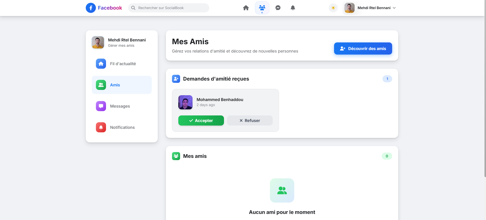

# Facebook Clone - Laravel Social Media Platform


A full-featured Facebook clone built with Laravel 12, featuring real-time social interactions, modern UI with Tailwind CSS, and comprehensive social media functionality.

## 🚀 Features

### Core Social Features
- **User Authentication & Registration** - Secure login system with Laravel Breeze
- **News Feed** - Dynamic timeline with posts from friends
- **Posts & Media** - Create, edit, delete posts with media support
- **Comments & Replies** - Nested commenting system with real-time updates
- **Likes & Reactions** - Like posts and comments with instant feedback
- **Post Sharing** - Share posts with custom messages
- **Friend System** - Send/accept/reject friend requests
- **User Profiles** - Customizable user profiles with bio and information
- **Real-time Notifications** - Instant notifications for interactions
- **Private Messaging** - Direct messaging between users
- **Friend Suggestions** - Smart friend recommendation system
- **Search Functionality** - Find friends and content

### Technical Features
- **Responsive Design** - Mobile-first approach with Tailwind CSS
- **Real-time Updates** - Live notifications and messaging
- **Modern UI/UX** - Clean, intuitive interface similar to Facebook
- **Database Optimization** - Efficient queries with relationships
- **Security** - CSRF protection, authentication, and authorization
- **Testing** - Comprehensive test suite with PHPUnit

## 📸 Screenshots

### Login Page

*Secure authentication system with modern UI design*

### Dashboard (News Feed)

*Main news feed with posts, comments, likes, and social interactions*

### Friends Management

*Friend requests, suggestions, and friend management interface*

### Notifications

*Real-time notification system for social interactions*

### Private Messaging

*Direct messaging interface for private conversations between users*

## 🛠️ Technology Stack

- **Backend**: Laravel ^12.0 (PHP 8.2+)
- **Frontend**: Blade Templates + Tailwind CSS + Alpine.js
- **Database**: PostgreSQL with Doctrine DBAL
- **Build Tools**: Vite
- **Authentication**: Laravel Breeze
- **Development Tools**: Laravel Sail, Pint, Pail, Concurrently

## 📋 Requirements

### System Requirements
- **PHP**: 8.2 or higher
- **Composer**: Latest version
- **Node.js**: 18.x or higher
- **NPM**: Latest version
- **Database**: PostgreSQL 13+

### PHP Extensions
- BCMath PHP Extension
- Ctype PHP Extension
- Fileinfo PHP Extension
- JSON PHP Extension
- Mbstring PHP Extension
- OpenSSL PHP Extension
- PDO PHP Extension
- Tokenizer PHP Extension
- XML PHP Extension

## 🚀 Quick Start

### 1. Clone the Repository
```bash
git clone <repository-url>
cd clone-facebook-laravel
```

### 2. Install Dependencies
```bash
# Install PHP dependencies
composer install

# Install Node.js dependencies
npm install
```

### 3. Environment Setup
```bash
# Copy environment file
cp .env.example .env

# Generate application key
php artisan key:generate
```

### 4. Database Configuration
Edit your `.env` file with your database credentials:

**For PostgreSQL (recommended):**
```env
DB_CONNECTION=pgsql
DB_HOST=127.0.0.1
DB_PORT=5432
DB_DATABASE=facebook_clone
DB_USERNAME=your_username
DB_PASSWORD=your_password
```

### 5. Database Setup
```bash
# Run migrations
php artisan migrate

# Seed the database (optional)
php artisan db:seed
```

### 6. Build Assets
```bash
# Development build
npm run dev

# Production build
npm run build
```

### 7. Start the Application
```bash
# Development server
php artisan serve
```

Visit `http://localhost:8000` in your browser.

## 🐳 Docker Development (Laravel Sail)

For a containerized development environment:

```bash
# Start Sail containers
./vendor/bin/sail up -d

# Run migrations
./vendor/bin/sail artisan migrate

# Install npm dependencies
./vendor/bin/sail npm install

# Build assets
./vendor/bin/sail npm run dev
```

Access the application at `http://localhost`

## 🔧 Development

### Running All Services Concurrently
The project includes a convenient development script:
```bash
composer run dev
```

This command starts (using concurrently):
- 🌐 Laravel development server (`php artisan serve`)
- ⚡ Queue worker (`php artisan queue:listen`)
- 📋 Log monitoring (`php artisan pail`)
- 🎨 Vite asset compilation (`npm run dev`)

### Individual Services
```bash
# Web server
php artisan serve

# Queue worker (for notifications)
php artisan queue:work

# Asset compilation (watch mode)
npm run dev

# Log monitoring
php artisan pail
```

### Testing
```bash
# Run tests
php artisan test

# Run tests with coverage
composer run test
```

### Code Quality
```bash
# Format code with Pint
./vendor/bin/pint

# Check code style
./vendor/bin/pint --test
```

## 📊 Database Schema

The application uses the following main entities:

- **Users** - User accounts and authentication
- **Profiles** - Extended user information
- **Posts** - User posts and content
- **Comments** - Post comments with threading
- **Likes** - Likes for posts and comments
- **Shares** - Post sharing functionality
- **Friends** - Friend relationships and requests
- **Messages** - Private messaging between users
- **Notifications** - System notifications

## 🎨 Frontend Structure

```
resources/views/
├── auth/           # Authentication views
├── components/     # Reusable Blade components
├── layouts/        # Layout templates
├── posts/          # Post-related views
├── friends/        # Friend management views
├── profile/        # User profile views
├── notifications/  # Notification views
├── messages/       # Messaging views
├── dashboard.blade.php  # Main news feed
└── welcome.blade.php    # Landing page
```

## 🛡️ Security Features

- CSRF Protection on all forms
- Authentication middleware on protected routes
- Authorization policies for resource access
- Input validation and sanitization
- Secure password hashing
- Rate limiting on API endpoints

## 📱 API Documentation

The application primarily uses web routes with some AJAX endpoints for:
- Real-time notifications
- Live messaging
- Dynamic content loading

Key AJAX endpoints:
- `POST /notifications/{id}/read` - Mark notification as read
- `POST /notifications/mark-all-read` - Mark all notifications as read

## 🤝 Contributing

1. Fork the repository
2. Create a feature branch (`git checkout -b feature/amazing-feature`)
3. Commit your changes (`git commit -m 'Add amazing feature'`)
4. Push to the branch (`git push origin feature/amazing-feature`)
5. Open a Pull Request

### Development Guidelines
- Follow PSR-12 coding standards
- Write tests for new features
- Update documentation for significant changes
- Use meaningful commit messages

## 📄 License

This project is open-sourced software licensed under the [MIT license](https://opensource.org/licenses/MIT).

## 🆘 Troubleshooting

### Common Issues

**Database connection errors:**
- Verify database credentials in `.env`
- Ensure database server is running
- Check PHP database extensions are installed

**Asset compilation issues:**
- Clear npm cache: `npm cache clean --force`
- Delete `node_modules` and reinstall: `rm -rf node_modules && npm install`
- Ensure Node.js version is 18.x or higher

**Permission errors:**
- Set proper permissions: `chmod -R 755 storage bootstrap/cache`
- Clear application cache: `php artisan cache:clear`

**Migrations failing:**
- Drop all tables and re-run: `php artisan migrate:fresh`
- Check database user permissions

### Performance Optimization

For production deployment:
```bash
# Optimize application
php artisan optimize

# Cache configuration
php artisan config:cache

# Cache routes
php artisan route:cache

# Cache views
php artisan view:cache
```

## 📞 Support

For support and questions:
- Create an issue in the repository
- Check the [Laravel Documentation](https://laravel.com/docs)
- Review existing issues and discussions

---

Built with ❤️ using Laravel and modern web technologies.
