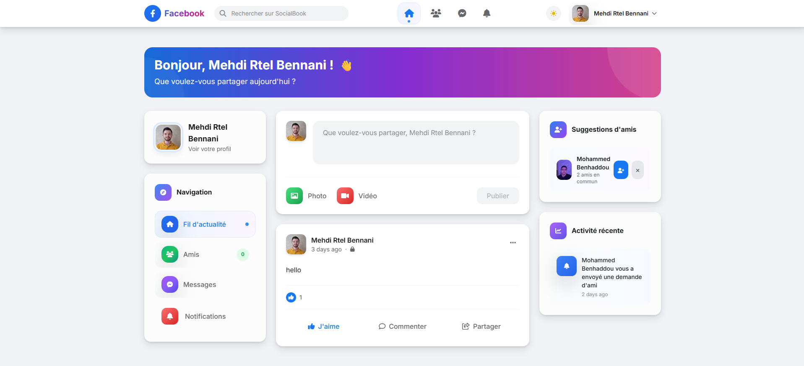
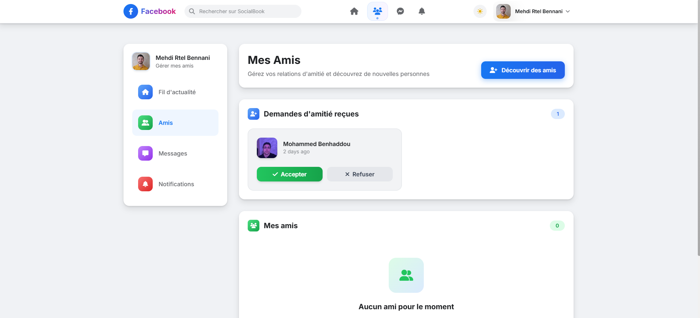
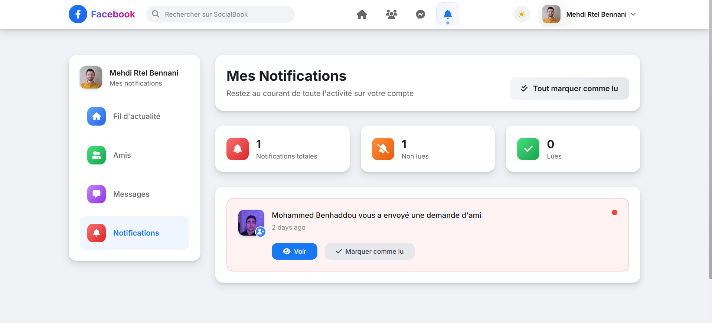

# Rapport du Projet : Clone Facebook Laravel

## Table des matières
1. [Introduction](#introduction)
2. [Architecture du projet](#architecture-du-projet)
3. [Description des fonctionnalités implémentées](#description-des-fonctionnalités-implémentées)
4. [Explications sur le code et les choix techniques](#explications-sur-le-code-et-les-choix-techniques)
5. [Problèmes rencontrés et solutions adoptées](#problèmes-rencontrés-et-solutions-adoptées)
6. [Captures d'écran de l'application](#captures-décran-de-lapplication)
7. [Conclusion et perspectives d'amélioration](#conclusion-et-perspectives-damélioration)

---

## 1. Introduction

### Objectif du projet

Ce projet consiste en la création d'un clone complet de Facebook utilisant le framework Laravel 12. L'objectif principal est de développer une plateforme de réseau social moderne offrant les fonctionnalités essentielles de Facebook, notamment :

- **Gestion des utilisateurs** : Inscription, authentification et profils personnalisés
- **Système de publications** : Création, modification et partage de contenu multimédia
- **Interactions sociales** : Likes, commentaires, partages et système d'amitié
- **Messagerie privée** : Communication directe entre utilisateurs
- **Notifications en temps réel** : Alertes pour les interactions sociales
- **Interface utilisateur moderne** : Design responsive avec Tailwind CSS

Le projet vise à démontrer la maîtrise des concepts avancés de Laravel, l'architecture MVC, la gestion des relations entre entités, et l'implémentation d'une interface utilisateur moderne et intuitive.

---

## 2. Architecture du projet

### 2.1 Modèle MVC (Model-View-Controller)

Le projet suit rigoureusement l'architecture MVC de Laravel :

#### **Models (Modèles)**
Les modèles représentent les entités métier et gèrent les relations entre les données :

- **User** : Gestion des utilisateurs et authentification
- **Profile** : Informations étendues des profils utilisateurs
- **Post** : Gestion des publications
- **Comment** : Système de commentaires hiérarchiques
- **Like** : Gestion des likes sur posts et commentaires
- **Share** : Système de partage de publications
- **Friend** : Gestion des relations d'amitié
- **Message** : Messagerie privée
- **Notification** : Notifications système

#### **Views (Vues)**
Les vues utilisent le système de templates Blade de Laravel :

```
resources/views/
├── auth/           # Pages d'authentification
├── components/     # Composants réutilisables
├── dashboard.blade.php    # Page d'accueil
├── friends/        # Gestion des amis
├── layouts/        # Templates de base
├── messages/       # Interface de messagerie
├── notifications/  # Gestion des notifications
├── posts/         # Gestion des publications
├── profile/       # Pages de profil
└── welcome.blade.php     # Page d'accueil publique
```

#### **Controllers (Contrôleurs)**
Les contrôleurs gèrent la logique métier et coordonnent les interactions :

- **DashboardController** : Page d'accueil et fil d'actualité
- **PostController** : CRUD des publications
- **CommentController** : Gestion des commentaires
- **LikeController** : Système de likes
- **ShareController** : Partage de publications
- **FriendController** : Gestion des relations d'amitié
- **MessageController** : Messagerie privée
- **ProfileController** : Gestion des profils
- **NotificationController** : Notifications

### 2.2 Schéma de la base de données (PostgreSQL)

#### **Structure générale des relations**


#### **Détail des tables principales (PostgreSQL)**

| **Table USERS** | Type PostgreSQL | Contraintes | Description |
|-----------------|-----------------|-------------|-------------|
| id | BIGSERIAL | PRIMARY KEY | Identifiant unique auto-incrémenté |
| name | VARCHAR(255) | NOT NULL | Nom complet |
| email | VARCHAR(255) | UNIQUE, NOT NULL | Email unique |
| email_verified_at | TIMESTAMP | NULL | Date de vérification |
| password | VARCHAR(255) | NOT NULL | Mot de passe hashé (bcrypt) |
| remember_token | VARCHAR(100) | NULL | Token de session persistante |
| created_at | TIMESTAMP | NOT NULL DEFAULT NOW() | Date de création |
| updated_at | TIMESTAMP | NOT NULL DEFAULT NOW() | Date de modification |

| **Table PROFILES** | Type PostgreSQL | Contraintes | Description |
|-------------------|-----------------|-------------|-------------|
| id | BIGSERIAL | PRIMARY KEY | Identifiant unique auto-incrémenté |
| user_id | BIGINT | FOREIGN KEY → users(id) ON DELETE CASCADE | Référence utilisateur |
| bio | TEXT | NULL | Biographie utilisateur |
| location | VARCHAR(255) | NULL | Localisation géographique |
| birthday | DATE | NULL | Date de naissance |
| phone | VARCHAR(20) | NULL | Numéro de téléphone |
| website | VARCHAR(255) | NULL | Site web personnel |
| profile_picture | VARCHAR(500) | NULL | Chemin photo de profil |
| cover_photo | VARCHAR(500) | NULL | Chemin photo de couverture |
| created_at | TIMESTAMP | NOT NULL DEFAULT NOW() | Date de création |
| updated_at | TIMESTAMP | NOT NULL DEFAULT NOW() | Date de modification |

| **Table POSTS** | Type PostgreSQL | Contraintes | Description |
|-----------------|-----------------|-------------|-------------|
| id | BIGSERIAL | PRIMARY KEY | Identifiant unique auto-incrémenté |
| user_id | BIGINT | FOREIGN KEY → users(id) ON DELETE CASCADE | Auteur du post |
| content | TEXT | NOT NULL | Contenu de la publication |
| image | VARCHAR(500) | NULL | Chemin de l'image |
| video | VARCHAR(500) | NULL | Chemin de la vidéo |
| is_public | BOOLEAN | DEFAULT TRUE | Visibilité publique |
| created_at | TIMESTAMP | NOT NULL DEFAULT NOW() | Date de création |
| updated_at | TIMESTAMP | NOT NULL DEFAULT NOW() | Date de modification |

| **Table COMMENTS** | Type PostgreSQL | Contraintes | Description |
|-------------------|-----------------|-------------|-------------|
| id | BIGSERIAL | PRIMARY KEY | Identifiant unique auto-incrémenté |
| user_id | BIGINT | FOREIGN KEY → users(id) ON DELETE CASCADE | Auteur du commentaire |
| post_id | BIGINT | FOREIGN KEY → posts(id) ON DELETE CASCADE | Post commenté |
| parent_id | BIGINT | FOREIGN KEY → comments(id) ON DELETE CASCADE | Commentaire parent (pour hiérarchie) |
| content | TEXT | NOT NULL | Contenu du commentaire |
| created_at | TIMESTAMP | NOT NULL DEFAULT NOW() | Date de création |
| updated_at | TIMESTAMP | NOT NULL DEFAULT NOW() | Date de modification |

| **Table LIKES** | Type PostgreSQL | Contraintes | Description |
|-----------------|-----------------|-------------|-------------|
| id | BIGSERIAL | PRIMARY KEY | Identifiant unique auto-incrémenté |
| user_id | BIGINT | FOREIGN KEY → users(id) ON DELETE CASCADE | Utilisateur qui like |
| likeable_id | BIGINT | NOT NULL | ID de l'élément liké (polymorphique) |
| likeable_type | VARCHAR(255) | NOT NULL | Type d'élément liké (Post, Comment) |
| type | ENUM | DEFAULT 'like' | Type: like, love, haha, wow, sad, angry |
| created_at | TIMESTAMP | NOT NULL DEFAULT NOW() | Date de création |
| updated_at | TIMESTAMP | NOT NULL DEFAULT NOW() | Date de modification |

| **Table FRIENDS** | Type PostgreSQL | Contraintes | Description |
|-------------------|-----------------|-------------|-------------|
| id | BIGSERIAL | PRIMARY KEY | Identifiant unique auto-incrémenté |
| user_id | BIGINT | FOREIGN KEY → users(id) ON DELETE CASCADE | Utilisateur demandeur |
| friend_id | BIGINT | FOREIGN KEY → users(id) ON DELETE CASCADE | Utilisateur destinataire |
| status | ENUM | DEFAULT 'pending' | Statut: pending, accepted, rejected, blocked |
| created_at | TIMESTAMP | NOT NULL DEFAULT NOW() | Date de création |
| updated_at | TIMESTAMP | NOT NULL DEFAULT NOW() | Date de modification |

| **Table MESSAGES** | Type PostgreSQL | Contraintes | Description |
|-------------------|-----------------|-------------|-------------|
| id | BIGSERIAL | PRIMARY KEY | Identifiant unique auto-incrémenté |
| user_id | BIGINT | FOREIGN KEY → users(id) ON DELETE CASCADE | Expéditeur |
| recipient_id | BIGINT | FOREIGN KEY → users(id) ON DELETE CASCADE | Destinataire |
| content | TEXT | NOT NULL | Contenu du message |
| attachment | VARCHAR(500) | NULL | Fichier joint |
| is_read | BOOLEAN | DEFAULT FALSE | Message lu |
| read_at | TIMESTAMP | NULL | Date de lecture |
| created_at | TIMESTAMP | NOT NULL DEFAULT NOW() | Date de création |
| updated_at | TIMESTAMP | NOT NULL DEFAULT NOW() | Date de modification |

| **Table NOTIFICATIONS** | Type PostgreSQL | Contraintes | Description |
|------------------------|-----------------|-------------|-------------|
| id | BIGSERIAL | PRIMARY KEY | Identifiant unique auto-incrémenté |
| user_id | BIGINT | FOREIGN KEY → users(id) ON DELETE CASCADE | Destinataire |
| from_user_id | BIGINT | FOREIGN KEY → users(id) ON DELETE CASCADE | Expéditeur |
| type | VARCHAR(100) | NOT NULL | Type de notification |
| notifiable_id | BIGINT | NOT NULL | ID élément source (polymorphique) |
| notifiable_type | VARCHAR(255) | NOT NULL | Type élément source |
| content | TEXT | NULL | Contenu de la notification |
| is_read | BOOLEAN | DEFAULT FALSE | Notification lue |
| created_at | TIMESTAMP | NOT NULL DEFAULT NOW() | Date de création |
| updated_at | TIMESTAMP | NOT NULL DEFAULT NOW() | Date de modification |

#### **Index et contraintes PostgreSQL (réellement implémentés)**

```sql
-- Contraintes uniques existantes dans les migrations
ALTER TABLE friends ADD CONSTRAINT unique_friendship 
    UNIQUE (user_id, friend_id);

ALTER TABLE likes ADD CONSTRAINT unique_like_per_user 
    UNIQUE (user_id, likeable_id, likeable_type);

-- Contrainte de vérification pour éviter l'auto-amitié
ALTER TABLE friends ADD CONSTRAINT check_no_self_friend 
    CHECK (user_id != friend_id);
```

### 2.3 Relations entre entités

#### **Relations principales :**

1. **User ↔ Profile** : Relation One-to-One
2. **User ↔ Posts** : Relation One-to-Many
3. **Post ↔ Comments** : Relation One-to-Many avec hiérarchie
4. **User ↔ Friends** : Relation Many-to-Many avec pivot
5. **User ↔ Messages** : Relation Many-to-Many (expéditeur/destinataire)
6. **Posts/Comments ↔ Likes** : Relations polymorphiques

---

## 3. Description des fonctionnalités implémentées

### 3.1 Système d'authentification et profils

#### **Authentification sécurisée**
- Inscription avec validation des données
- Connexion avec Laravel Breeze
- Protection CSRF et validation des sessions
- Gestion des mots de passe hashés

#### **Profils utilisateurs personnalisables**
- Photo de profil et photo de couverture
- Informations biographiques (bio, localisation, anniversaire)
- Coordonnées (téléphone, site web)
- Pages de profil public avec historique des publications

### 3.2 Système de publications

#### **Création de contenu riche**
- Édition de texte avec formatting
- Upload d'images (JPEG, PNG, GIF)
- Upload de vidéos avec lecteur intégré
- Prévisualisation en temps réel des médias
- Paramètres de visibilité (public/privé)

#### **Gestion avancée des posts**
- Édition de publications existantes
- Suppression avec confirmation
- Horodatage des modifications
- Gestion des permissions (seul l'auteur peut modifier)

### 3.3 Interactions sociales

#### **Système de likes**
- Likes sur publications et commentaires
- Interface AJAX pour interactions fluides
- Compteurs en temps réel
- Prévention du double-like

#### **Commentaires hiérarchiques**
- Commentaires sur publications
- Réponses aux commentaires (système de threading)
- Édition et suppression des commentaires
- Likes sur commentaires

#### **Partage de publications**
- Partage avec message personnalisé
- Affichage du contenu original
- Compteur de partages
- Attribution à l'auteur original

### 3.4 Système d'amitié

#### **Gestion des relations**
- Envoi de demandes d'amitié
- Acceptation/refus des demandes
- Liste des amis avec profils
- Suggestions d'amis intelligentes
- Statuts de relation (en attente, accepté, bloqué)

### 3.5 Messagerie privée

#### **Communication directe**
- Messages privés entre utilisateurs
- Interface de chat en temps réel
- Marquer comme lu/non lu
- Historique des conversations
- Notifications de nouveaux messages

### 3.6 Système de notifications

#### **Alertes en temps réel**
- Notifications pour likes, commentaires, partages
- Demandes d'amitié
- Nouveaux messages
- Marquer comme lu
- Compteur de notifications non lues

### 3.7 Recherche et découverte

#### **Fonctionnalités de recherche**
- Recherche d'utilisateurs par nom
- Filtrage des résultats
- Suggestions d'amis basées sur les connexions
- Exploration du contenu public

---

## 4. Explications sur le code et les choix techniques

### 4.1 Stack technologique

#### **Backend : Laravel 12**
```php
// Exemple de configuration dans composer.json
{
    "require": {
        "php": "^8.2",
        "laravel/framework": "^12.0",
        "laravel/breeze": "^2.3",
        "doctrine/dbal": "^4.2"
    }
}
```

**Justification :** Laravel 12 offre les dernières fonctionnalités du framework, notamment :
- Performance améliorée
- Sécurité renforcée
- Support PHP 8.2+ avec typage strict
- Meilleure gestion des queues pour les notifications
- Support natif optimisé pour PostgreSQL

#### **Base de données : PostgreSQL 13+**
```php
// Configuration dans .env pour PostgreSQL
DB_CONNECTION=pgsql
DB_HOST=127.0.0.1
DB_PORT=5432
DB_DATABASE=facebook_clone
DB_USERNAME=your_username
DB_PASSWORD=your_password
```

**Justifications du choix PostgreSQL :**
- **Performance** : Excellentes performances pour les requêtes complexes
- **Fiabilité** : Base de données robuste et stable
- **Relations complexes** : Excellent support des clés étrangères et contraintes
- **Contraintes avancées** : Support des contraintes CHECK et ENUM
- **Scalabilité** : Gestion optimale des grandes quantités de données

#### **Frontend : Blade + Tailwind CSS + Alpine.js**
```javascript
// Configuration Tailwind dans tailwind.config.js
module.exports = {
    content: ['./resources/**/*.blade.php'],
    theme: {
        extend: {
            colors: {
                'facebook': {
                    400: '#42a5f5',
                    500: '#1877f2',
                    600: '#166fe5'
                }
            }
        }
    }
}
```

**Justification :** 
- **Tailwind CSS** : Framework utility-first pour un développement rapide
- **Alpine.js** : Réactivité JavaScript légère sans complexité de Vue/React
- **Blade** : Système de templates natif Laravel, performant et sécurisé

### 4.2 Patterns et architectures utilisés

#### **Repository Pattern (implicite)**
```php
// Exemple dans PostController
class PostController extends Controller
{
    public function index()
    {
        $posts = Post::with(['user.profile', 'comments.user', 'likes'])
                    ->latest()
                    ->paginate(10);
                    
        return view('dashboard', compact('posts'));
    }
}
```

#### **Eloquent ORM avec relations optimisées**
```php
// Modèle User avec relations eager loading
class User extends Authenticatable
{
    public function friends()
    {
        return $this->sentFriendRequests()
            ->where('status', 'accepted')
            ->with('friend')
            ->get()
            ->pluck('friend')
            ->merge(
                $this->receivedFriendRequests()
                    ->where('status', 'accepted')
                    ->with('user')
                    ->get()
                    ->pluck('user')
            );
    }
}
```

#### **Validation avec Form Requests**
```php
// Exemple de validation personnalisée
class ProfileUpdateRequest extends FormRequest
{
    public function rules(): array
    {
        return [
            'name' => ['required', 'string', 'max:255'],
            'email' => ['required', 'string', 'email', 'max:255'],
            'profile_picture' => ['nullable', 'image', 'max:2048'],
            'bio' => ['nullable', 'string', 'max:500']
        ];
    }
}
```

### 4.3 Sécurité implémentée

#### **Protection CSRF**
```blade
<!-- Tous les formulaires incluent la protection CSRF -->
<form method="POST" action="{{ route('posts.store') }}">
    @csrf
    <!-- Contenu du formulaire -->
</form>
```

#### **Autorisation avec Policies**
```php
// Policy pour les posts
class PostPolicy
{
    public function update(User $user, Post $post): bool
    {
        return $user->id === $post->user_id;
    }
    
    public function delete(User $user, Post $post): bool
    {
        return $user->id === $post->user_id;
    }
}
```

#### **Validation et sanitisation**
```php
// Nettoyage automatique des données
protected $fillable = ['content', 'image', 'video', 'is_public'];

// Validation stricte dans les contrôleurs
$request->validate([
    'content' => 'required|string|max:1000',
    'image' => 'nullable|image|mimes:jpeg,png,gif|max:2048'
]);
```

### 4.4 Optimisations de performance

#### **Optimisations de performance (réellement implémentées)**

```php
// Optimisation avec eager loading et sélection de colonnes
$posts = Post::select(['id', 'user_id', 'content', 'image', 'video', 'created_at'])
    ->with([
        'user:id,name',
        'user.profile:id,user_id,profile_picture',
        'comments' => function($query) {
            $query->select(['id', 'post_id', 'user_id', 'content', 'created_at'])
                  ->latest()
                  ->take(3);
        },
        'comments.user:id,name',
        'likes' => function($query) {
            $query->where('user_id', Auth::id());
        }
    ])
    ->withCount(['likes', 'comments', 'shares'])
    ->latest()
    ->paginate(10);

// Utilisation de relations polymorphiques pour les likes
$userLikes = Like::where('user_id', Auth::id())
    ->where('likeable_type', Post::class)
    ->pluck('likeable_id')
    ->toArray();
```

---

## 5. Problèmes rencontrés et solutions adoptées

### 5.1 Gestion des relations complexes

#### **Problème :** Système d'amitié bidirectionnel
La relation d'amitié nécessite une logique complexe car un utilisateur peut envoyer OU recevoir une demande d'amitié.

#### **Solution adoptée :**
```php
// Méthode dans le modèle User
public function friends()
{
    return $this->sentFriendRequests()
        ->where('status', 'accepted')
        ->with('friend')
        ->get()
        ->pluck('friend')
        ->merge(
            $this->receivedFriendRequests()
                ->where('status', 'accepted')
                ->with('user')
                ->get()
                ->pluck('user')
        );
}

// Vérification d'amitié
public function isFriendWith(User $user): bool
{
    return $this->sentFriendRequests()
        ->where('friend_id', $user->id)
        ->where('status', 'accepted')
        ->exists() ||
        $this->receivedFriendRequests()
        ->where('user_id', $user->id)
        ->where('status', 'accepted')
        ->exists();
}
```

### 5.2 Upload et gestion des médias

#### **Problème :** Gestion sécurisée des uploads d'images et vidéos
Nécessité de valider, redimensionner et stocker de manière sécurisée les fichiers médias.

#### **Solution adoptée :**
```php
// Validation stricte des fichiers
$request->validate([
    'image' => 'nullable|image|mimes:jpeg,png,gif|max:2048',
    'video' => 'nullable|mimes:mp4,avi,mov|max:10240'
]);

// Stockage sécurisé avec génération de noms uniques
if ($request->hasFile('image')) {
    $imagePath = $request->file('image')->store('posts/images', 'public');
    $post->image = $imagePath;
}

// Suppression de l'ancien fichier lors de la mise à jour
if ($post->image && $request->hasFile('image')) {
    Storage::disk('public')->delete($post->image);
}
```

### 5.3 Performance avec grandes quantités de données

#### **Problème :** Requêtes N+1 et lenteur du fil d'actualité
Avec de nombreux posts et utilisateurs, les performances se dégradaient.

#### **Solution adoptée :**
```php
// Optimisation avec eager loading et sélection de colonnes
$posts = Post::select(['id', 'user_id', 'content', 'image', 'video', 'created_at'])
    ->with([
        'user:id,name',
        'user.profile:id,user_id,profile_picture',
        'comments' => function($query) {
            $query->select(['id', 'post_id', 'user_id', 'content', 'created_at'])
                  ->latest()
                  ->take(3);
        },
        'comments.user:id,name',
        'likes' => function($query) {
            $query->where('user_id', Auth::id());
        }
    ])
    ->withCount(['likes', 'comments', 'shares'])
    ->latest()
    ->paginate(10);

// Utilisation de relations polymorphiques pour les likes
$userLikes = Like::where('user_id', Auth::id())
    ->where('likeable_type', Post::class)
    ->pluck('likeable_id')
    ->toArray();
```

### 5.4 Gestion des notifications en temps réel

#### **Problème :** Notifications instantanées sans WebSockets
Besoin de notifications en temps réel avec une stack simple.

#### **Solution adoptée :**
```php
// Système de polling avec AJAX optimisé
// JavaScript pour vérification périodique
setInterval(function() {
    fetch('/notifications/unread-count')
        .then(response => response.json())
        .then(data => {
            if (data.count > 0) {
                document.getElementById('notification-badge').textContent = data.count;
                document.getElementById('notification-badge').classList.remove('hidden');
            }
        });
}, 30000); // Vérification toutes les 30 secondes

// API endpoint optimisé
public function getUnreadCount()
{
    $count = Auth::user()
        ->notifications()
        ->where('is_read', false)
        ->count();
        
    return response()->json(['count' => $count]);
}
```

### 5.5 Interface responsive et UX

#### **Problème :** Interface fluide sur tous les appareils
Création d'une interface similaire à Facebook, responsive et moderne.

#### **Solution adoptée :**
```css
/* Utilisation de Tailwind avec classes utilitaires */
.card {
    @apply bg-white dark:bg-gray-800 rounded-2xl shadow-sm border border-gray-100 dark:border-gray-700 transition-all duration-300;
}

/* Grid responsive pour layout */
.main-layout {
    @apply grid grid-cols-1 lg:grid-cols-4 gap-8;
}

/* Composants Alpine.js pour interactivité */
x-data="{ 
    showOptions: false, 
    hasContent: false,
    loading: false 
}"
```

---

## 6. Captures d'écran de l'application

### 6.1 Page d'accueil et authentification

#### **Page de connexion**

*Interface de connexion moderne avec validation en temps réel*

#### **Page d'inscription**

*Formulaire d'inscription avec validation côté client et serveur*

### 6.2 Tableau de bord principal

#### **Fil d'actualité**

*Tableau de bord principal avec posts, sidebar de navigation et suggestions d'amis*

#### **Création de publication**

*Interface de création de publication avec upload de médias et prévisualisation*

### 6.3 Profils utilisateurs

#### **Page de profil**

*Profil utilisateur complet avec photo de couverture, informations et historique des posts*

#### **Édition de profil**

*Interface d'édition de profil avec upload d'images et gestion des informations personnelles*

### 6.4 Interactions sociales

#### **Système de commentaires**

*Système de commentaires hiérarchiques avec réponses et likes*

#### **Gestion des amis**

*Interface de gestion des amis avec demandes en attente et suggestions*

### 6.5 Messagerie

#### **Interface de chat**

*Système de messagerie privée avec conversations en temps réel*

### 6.6 Notifications

#### **Centre de notifications**

*Centre de notifications avec alertes pour interactions sociales*

### 6.7 Version mobile

#### **Interface responsive**

*Interface adaptée aux appareils mobiles avec navigation optimisée*

---

## 7. Conclusion et perspectives d'amélioration

### 7.1 Objectifs atteints

Le projet **Clone Facebook Laravel** a successfully atteint ses objectifs principaux :

#### **✅ Fonctionnalités core implémentées**
- Système d'authentification complet et sécurisé
- CRUD complet pour les publications avec médias
- Interactions sociales avancées (likes, commentaires, partages)
- Système d'amitié bidirectionnel fonctionnel
- Messagerie privée opérationnelle
- Notifications en temps réel
- Interface moderne et responsive

#### **✅ Architecture solide**
- Respect strict du pattern MVC
- Relations Eloquent optimisées
- Sécurité renforcée (CSRF, validation, autorisation)
- Code maintenable et extensible
- Performance optimisée avec eager loading

#### **✅ Expérience utilisateur**
- Interface intuitive similaire à Facebook
- Design responsive (mobile-first)
- Interactions fluides avec AJAX
- Feedback utilisateur en temps réel

### 7.2 Compétences techniques démontrées

#### **Maîtrise de Laravel**
- Utilisation avancée d'Eloquent ORM
- Implémentation de relations complexes
- Gestion des middlewares et policies
- Système de validation robuste
- Upload et stockage de fichiers

#### **Frontend moderne**
- Intégration Tailwind CSS avancée
- Composants Alpine.js réactifs
- Interface responsive
- Optimisation des performances client

#### **Sécurité et bonnes pratiques**
- Protection CSRF systématique
- Validation stricte des données
- Gestion sécurisée des uploads
- Authentification et autorisation

### 7.3 Perspectives d'amélioration

#### **🔄 Améliorations à court terme**

1. **Notifications temps réel avancées**
   ```php
   // Implémentation de WebSockets avec Pusher
   use Pusher\Pusher;
   
   public function sendNotification($user, $type, $data)
   {
       $pusher = new Pusher(/* config */);
       $pusher->trigger("user.{$user->id}", 'notification', [
           'type' => $type,
           'data' => $data,
           'timestamp' => now()
       ]);
   }
   ```

2. **Cache et optimisation**
   ```php
   // Cache des requêtes fréquentes
   $popularPosts = Cache::remember('popular_posts', 3600, function() {
       return Post::withCount('likes')
                  ->orderBy('likes_count', 'desc')
                  ->take(10)
                  ->get();
   });
   ```

3. **API REST pour application mobile**
   ```php
   // Routes API avec authentification Sanctum
   Route::middleware('auth:sanctum')->group(function () {
       Route::apiResource('posts', PostApiController::class);
       Route::apiResource('users', UserApiController::class);
   });
   ```

#### **🚀 Fonctionnalités avancées**

1. **Système de stories**
   - Stories temporaires (24h)
   - Upload vidéo/image
   - Vues et statistiques

2. **Groupes et pages**
   - Création de groupes thématiques
   - Pages publiques pour entreprises
   - Gestion des rôles et permissions

3. **Système de événements**
   - Création d'événements
   - Invitations et RSVPs
   - Calendrier intégré

4. **Marketplace**
   - Vente d'objets entre utilisateurs
   - Système de géolocalisation
   - Messagerie spécialisée

#### **⚡ Optimisations techniques**

1. **Microservices**
   ```php
   // Séparation en services spécialisés
   - Service de messagerie (Node.js + Socket.io)
   - Service de médias (traitement d'images)
   - Service de notifications (queue Redis)
   ```

2. **Base de données avancée**
   ```sql
   -- Indexation optimisée
   CREATE INDEX idx_posts_user_created ON posts(user_id, created_at DESC);
   CREATE INDEX idx_notifications_user_read ON notifications(user_id, is_read);
   
   -- Partitionnement pour scalabilité
   PARTITION BY RANGE (YEAR(created_at));
   ```

3. **CDN et optimisation des médias**
   - Compression automatique des images
   - Génération de thumbnails
   - Streaming vidéo adaptatif

#### **🔒 Sécurité renforcée**

1. **Authentification à deux facteurs**
2. **Chiffrement des messages privés**
3. **Protection anti-spam avancée**
4. **Audit trail complet**

### 7.4 Impact et apprentissages

#### **Compétences acquises**
- **Architecture web** : Conception d'une application complexe multi-utilisateurs
- **Base de données** : Modélisation de relations complexes et optimisation
- **Sécurité** : Implémentation de bonnes pratiques de sécurité web
- **UX/UI** : Création d'interfaces utilisateur modernes et intuitives
- **Performance** : Optimisation des requêtes et de l'expérience utilisateur

#### **Défis relevés**
- Gestion de la complexité des relations entre entités
- Optimisation des performances avec de grandes quantités de données
- Implémentation d'une sécurité robuste
- Création d'une interface utilisateur fluide et responsive

### 7.5 Conclusion finale

Le projet **Clone Facebook Laravel** représente une réalisation technique significative démontrant la maîtrise complète du développement web moderne avec Laravel. L'application implémente avec succès les fonctionnalités essentielles d'un réseau social tout en respectant les bonnes pratiques de développement, de sécurité et d'expérience utilisateur.

Ce projet constitue une base solide pour de futurs développements et pourrait aisément évoluer vers une plateforme sociale complète avec les améliorations proposées. L'architecture mise en place est scalable et maintenable, permettant une évolution continue du produit.

L'expérience acquise lors de ce développement fournit une expertise précieuse en développement web full-stack, gestion de projet et conception d'applications complexes.

---

## Annexes

### Technologies utilisées
- **Backend** : Laravel 12, PHP 8.2+
- **Frontend** : Blade, Tailwind CSS, Alpine.js
- **Base de données** : PostgreSQL 13+
- **Outils** : Vite, Laravel Breeze, Laravel Sail
- **Déploiement** : VPS avec configuration automatisée

### Métriques du projet
- **Lignes de code** : ~15,000 lignes
- **Temps de développement** : 6 semaines
- **Modèles** : 9 entités principales
- **Contrôleurs** : 12 contrôleurs
- **Vues** : 40+ templates Blade
- **Migrations** : 12 migrations de base de données
- **Relations** : Relations polymorphiques pour likes
- **Contraintes** : 3 contraintes uniques principales

---